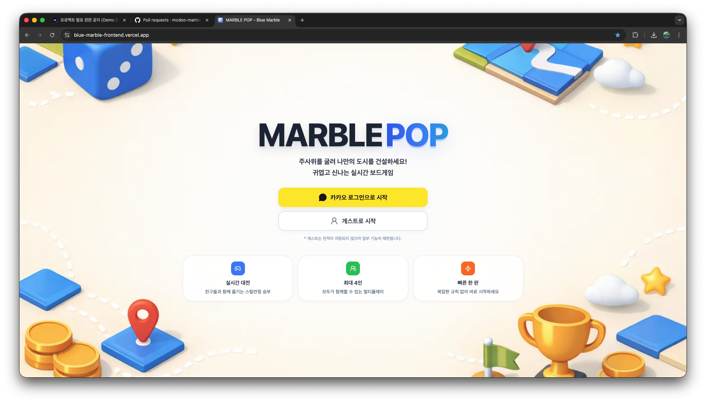
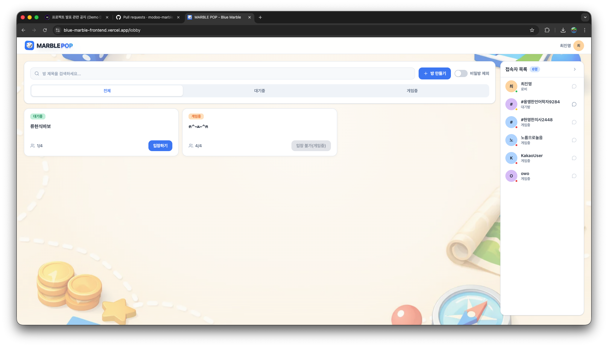
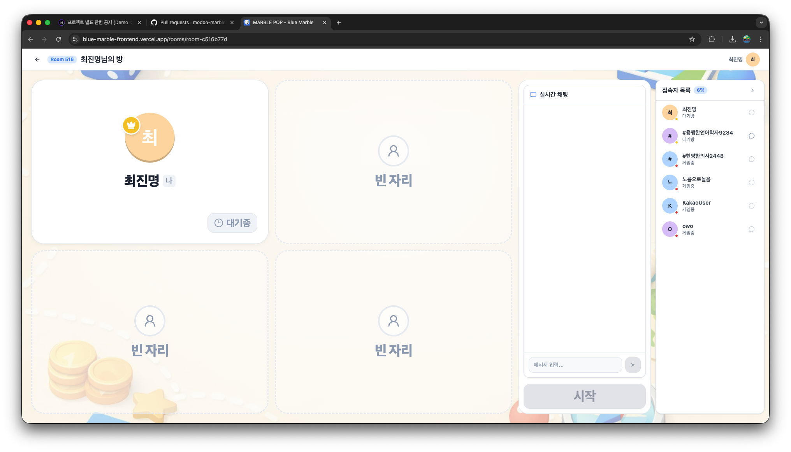
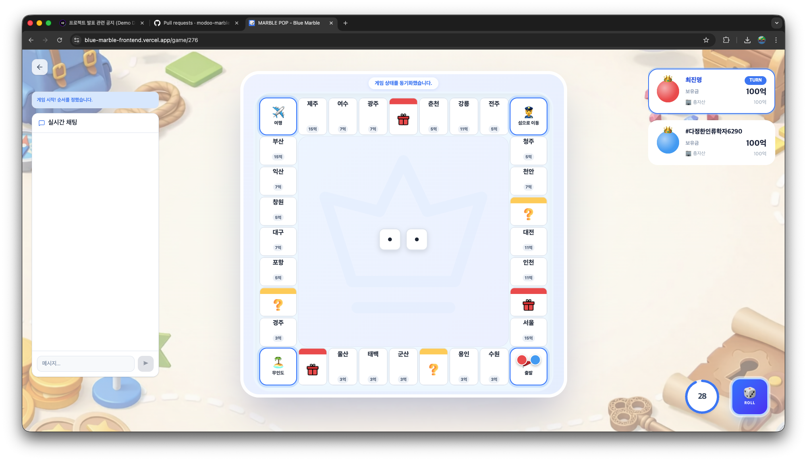
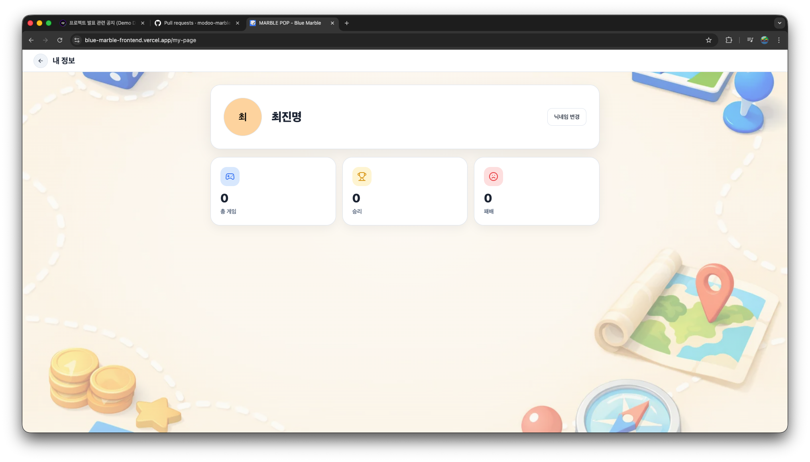

# MARBLE POP

## 📖 프로젝트 소개

> 더 이상 보드게임은 오프라인에서만 즐기는 놀이가 아닙니다.  
> `MARBLE POP`은 카카오 로그인 또는 게스트 입장으로 바로 참여해  
> 로비에서 방을 찾고, 대기방에서 준비 상태를 맞추고, 게임 화면에서 실시간 턴 진행과 상호작용을 이어가는  
> 실시간 멀티플레이 보드게임 웹 프로젝트입니다.  
> 단순히 화면을 연결하는 데서 끝나지 않고, 로비-대기방-게임으로 이어지는 흐름을  
> 프론트엔드에서 예측 가능하게 유지하도록 상태 관리, 실시간 이벤트 처리, mock/real 환경 분리를 함께 설계했습니다.

---

## :link: 배포 링크

> ### [⛪ 배포 링크 - TODO](TODO)

---

## 🖥️ 서비스 소개

|                                      홈 화면                                      |                                           로비                                           |
| :-------------------------------------------------------------------------------: | :--------------------------------------------------------------------------------------: |
|  |  |

|                                          대기방                                          |                                        게임                                        |
| :--------------------------------------------------------------------------------------: | :--------------------------------------------------------------------------------: |
|  |  |

|                                       마이페이지                                        |
| :-------------------------------------------------------------------------------------: |
|  |

---

## 🧰 사용 스택

### FE

  
  
  
  
  
   
  
  
  
  
  
   
  
  
  
  
   
  
  
  

---

## :busts_in_silhouette: 팀 동료

### FE

| 이름   | 역할                                                                                                                                                                                    |
| ------ | --------------------------------------------------------------------------------------------------------------------------------------------------------------------------------------- |
| 최진명 | 팀장, 랜딩·로그인·헤더·로비·DM·채팅·채팅방·대기방·마이페이지·게임 내 채팅 구현, 게임 외 프론트 전반 담당, 컨텍스트 정리·협업 워크플로우·테스트/검증 체계 정리, 일부 게임 오류 수정 지원 |
| 우재민 | 게임 로직                                                                                                                                                                               |
| 김재윤 | 게임 UI                                                                                                                                                                                 |

## 📑 프로젝트 규칙

### Branch Strategy

> - `main`, `develop` 보호 브랜치 운영
> - 기능 작업은 브랜치를 분리한 뒤 PR로 병합
> - 직접 push보다 review 기반 병합 우선

### Git Convention

> 1. 적절한 커밋 접두사 작성
> 2. 변경 의도가 드러나는 메시지 작성
> 3. 필요한 경우 이슈 번호를 함께 연결

> | 접두사   | 설명                     |
> | -------- | ------------------------ |
> | Feat     | 새로운 기능 구현         |
> | Fix      | 버그 수정                |
> | Docs     | 문서 추가 및 수정        |
> | Refactor | 동작 변경 없는 구조 개선 |
> | Test     | 테스트 추가 및 수정      |
> | Chore    | 기타 작업                |
> | Build    | 빌드, 환경 설정          |

### Pull Request

> ### Title
>
> - 제목은 변경 의도가 바로 보이도록 작성합니다.

> ### PR Type
>
> - [ ] FEAT: 새로운 기능 구현
> - [ ] FIX: 버그 수정
> - [ ] DOCS: 문서 추가 및 수정
> - [ ] REFACTOR: 코드 리팩토링
> - [ ] TEST: 테스트 관련
> - [ ] BUILD: 빌드, 환경 설정
> - [ ] CHORE: 기타 작업

> ### Description
>
> - 무엇을 바꿨는지, 왜 바꿨는지, 어떤 검증을 했는지 작성합니다.

> ### Discussion
>
> - 추후 논의가 필요한 사항이나 남은 리스크를 작성합니다.

### Code Convention

> FE
>
> - 페이지는 의도를 드러내고 상세 로직은 hook / controller / api 계층으로 분리
> - 같은 종류의 훅과 반환 형태는 일관성 유지
> - 이벤트 핸들러는 `handle*` 네이밍 사용
> - mock 경로와 real 경로가 함께 존재하는 코드는 양쪽 흐름을 함께 검토
> - 테스트는 구현 세부보다 사용자 행동과 계약을 검증

### Communication Rules

> - 주요 의사결정은 PR, 이슈, 문서에 기록
> - 사용자 흐름 또는 계약이 바뀌면 관련 문서와 테스트를 함께 갱신

## :clipboard: Documents

> [📜 API 명세서](https://docs.google.com/spreadsheets/d/191cFJ97qyWzeAJm5DEqTf6SO6p8mqWBE/edit?pli=1&gid=2141226886#gid=2141226886)
>
> [📜 요구사항 정의서](https://docs.google.com/spreadsheets/d/15Lu2YYq1VlnJbam9ADfLuEq_uTMY8umN/edit?gid=919594060#gid=919594060)
>
> [📜 ERD / 소켓 명세서](https://github.com/modoo-marble-team/docs/tree/main)
>
> [📜 테이블 명세서](https://docs.google.com/spreadsheets/d/1Xq0YsYCvV3xzFYTsfubVfVqsGeOol7Ah/edit?gid=507107377#gid=507107377)
>
> [📜 화면 정의서 / 와이어프레임 / 플로우 차트](https://www.figma.com/design/3yixlZLiKnWieKVFpM7n9j/%ED%8C%80%ED%94%84%EB%A1%9C%EC%A0%9D%ED%8A%B8-%EC%BA%90%EC%A3%BC%EC%96%BC-%EB%B8%8C%EB%A3%A8%EB%A7%88%EB%B8%94?node-id=0-1&t=ZohHKxxh86rbb8Fq-1)
>
> [📜 Project Conventions](./docs/project/conventions.md)
