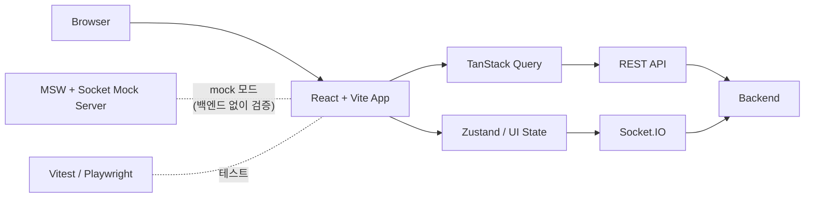

# MARBLE POP

[](https://github.com/modoo-marble-team/Blue_Marble-frontend/actions/workflows/ci.yml)
[](https://github.com/modoo-marble-team/Blue_Marble-frontend/actions/workflows/workflow-gate.yml)

## 📖 프로젝트 소개

> 더 이상 보드게임은 오프라인에서만 즐기는 놀이가 아닙니다.  
> `MARBLE POP`은 카카오 로그인 또는 게스트 입장으로 바로 참여해  
> 로비에서 방을 찾고, 대기방에서 준비 상태를 맞추고, 게임 화면에서 실시간 턴 진행과 상호작용을 이어가는  
> 실시간 멀티플레이 보드게임 웹 프로젝트입니다.

`MARBLE POP Frontend`는 로그인 이후의 사용자 흐름을 웹에서 안정적으로 이어주는 클라이언트입니다. REST 조회는 TanStack Query로, 게임과 프레즌스 같은 실시간 상태는 Socket.IO와 Zustand로 정리하고, 개발 단계에서는 MSW와 socket mock server를 병행해 mock/real 경로를 같은 UI에서 검증할 수 있게 구성했습니다.

단순한 화면 구현에서 끝나지 않고, **백엔드 없이도 실시간 시나리오를 검증할 수 있는 환경 설계**, **여러 퇴장 경로를 단일 흐름으로 안전하게 통합**, **AI 협업 기준을 저장소 구조로 강제**하는 것을 프로젝트 내에서 함께 다뤘습니다.

> 기간: 2026.02 ~ 2026.03 (5주) · 팀: FE 3인, BE 3인

### 프론트엔드가 맡는 역할

- 로그인 이후 라우팅, 세션 복구, 페이지 진입 제어
- 로비, 대기방, 게임 화면의 상태 렌더링과 사용자 입력 전달
- REST 응답과 실시간 socket 이벤트를 하나의 UI 상태로 정렬
- mock/real 런타임 전환, 테스트, 문서화

---

## 🔗 배포 링크

> ### [⛪ MARBLE POP 배포 링크](https://blue-marble-frontend.vercel.app/)

> **배포 환경은 mock 데모 모드로 동작합니다.**  
> 백엔드 서버 없이도 로그인 → 로비 → 대기방 → 게임 시작까지 혼자 확인할 수 있습니다.  
> (소켓 이벤트·채팅·DM·준비 흐름도 mock으로 재현됩니다)

## ✨ 기술적 하이라이트

- **백엔드 없이도 실시간 흐름 검증**: Socket.IO mock server와 개발 패널로 방 입장·준비·채팅 시나리오를 로컬에서 반복 재현. Vitest로 로직, Playwright로 브라우저 흐름을 역할별로 나눠 검증 체계 구성.
- **퇴장 경로 단일화**: 뒤로가기·로그아웃·cleanup·beforeunload 등 여러 퇴장 경로를 하나의 공통 흐름으로 통합. in-flight 요청 재사용과 StrictMode·탭 숨김 경계 처리로 중복 API/소켓 호출 제거.
- **AI 협업 워크플로우**: AGENTS.md 기준 문서와 CI Workflow Gate로 팀 전체 작업 기준 통일. 고위험 PR에서만 머지를 차단하고, 생성형 리뷰(Gemini)가 판단이 필요한 버그 가능성을 추가로 탐지.

---

## 🖥️ 서비스 소개

|                                      홈 화면                                      |                                           로비                                           |
| :-------------------------------------------------------------------------------: | :--------------------------------------------------------------------------------------: |
|  |  |

|                                          대기방                                          |                                       마이페이지                                        |
| :--------------------------------------------------------------------------------------: | :-------------------------------------------------------------------------------------: |
|  |  |

|                                        게임                                        |
| :--------------------------------------------------------------------------------: |
|  |

---

## 🏗️ 아키텍처



- **일반 모드**: REST와 Socket.IO로 백엔드와 통신합니다.
- **mock 모드**: MSW와 local socket mock server로 페이지 흐름과 실시간 상호작용을 로컬에서 검증합니다.
- 페이지는 의도를 드러내고, 상세 흐름은 hook/controller/api 계층으로 분리하는 구조를 유지합니다.

---

## 🗂️ 프로젝트 구조

```text
.
├─ src/
│  ├─ pages/
│  │  ├─ lobby/                # 로비 페이지 및 방 진입 흐름
│  │  ├─ waiting-room/         # 대기방 lifecycle, ready/start/leave
│  │  └─ GamePage.tsx          # 게임 런타임 화면 조합
│  ├─ features/
│  │  ├─ presence/             # 접속자 목록, DM, unread badge
│  │  └─ room-chat/            # 대기방·게임 채팅
│  ├─ components/
│  │  ├─ game/                 # 게임 UI 컴포넌트 (모달, 패널)
│  │  └─ board/                # 보드 렌더링
│  ├─ hooks/game/              # 주사위, 턴, 타이머 등 게임 보조 훅
│  ├─ services/socket/         # socket contract adapter / emit handler
│  ├─ stores/                  # zustand store
│  ├─ mocks/                   # MSW mock handler
│  └─ contracts/socket/        # socket schema / policy
├─ mock-socket-server/         # 로컬 socket mock server
├─ e2e/                        # Playwright 시나리오
├─ docs/project/               # 공개용 프로젝트 문서 / README 자산
└─ scripts/ai/                 # repo workflow / validation 도구
```

---

## 🚀 빠르게 실행하기

> **Prerequisites**: Node.js 18+

### 1. 저장소 클론 및 의존성 설치

```bash
git clone https://github.com/modoo-marble-team/Blue_Marble-frontend.git
cd Blue_Marble-frontend
npm install
```

### 2. 환경 변수 준비

```bash
cp .env.example .env.development.local
```

- `.env.example`는 기본값 예시입니다.
- `.env.development.local`은 개인 로컬 override 용도로 사용합니다.
- `npm run env:mock`, `npm run env:real`은 `.env.development`를 각각 mock/real 템플릿으로 바꾸고, 있으면 `.env.development.local`의 mock 관련 플래그도 함께 맞춰줍니다.

### 3. 실행 모드 선택

**실제 백엔드 연결:**

```bash
npm run env:real
npm run dev
```

**mock 기반 로컬 검증:**

```bash
# 터미널 1 — 개발 서버
npm run env:mock
npm run dev

# 터미널 2 — socket mock server
npm run socket:mock
```

### 4. 확인

| 경로                    | 설명                                        |
| ----------------------- | ------------------------------------------- |
| `http://localhost:5173` | Vite 개발 서버                              |
| `npm run env:show`      | 현재 `.env.development` mock/real 모드 확인 |

---

## 🔧 주요 환경 변수

| 변수                        | 기본값 예시                 | 설명                                                 |
| --------------------------- | --------------------------- | ---------------------------------------------------- |
| `VITE_API_URL`              | `http://localhost:3000/api` | REST API base URL                                    |
| `VITE_SOCKET_URL`           | `http://localhost:3000`     | Socket.IO base URL                                   |
| `VITE_USE_SOCKET_MOCK`      | `false`                     | 개발 환경에서 MSW + socket mock 경로를 사용할지 결정 |
| `VITE_ENABLE_DEMO_MOCK`     | `true` (배포 기본)          | 배포/데모 환경 mock 모드 강제 여부 (`false`로 해제)  |
| `VITE_ALLOW_ALL_MOCK_TURNS` | `false`                     | mock 게임에서 턴 제한을 무시할지 결정                |

> mock 모드를 켜면 MSW와 socket mock server 기준으로 화면 흐름을 검증합니다.  
> 프로덕션 빌드는 기본적으로 mock 데모 모드이며, 실제 서버를 쓰려면 `VITE_ENABLE_DEMO_MOCK=false`를 명시해야 합니다.

---

## 🧪 자주 쓰는 명령어

| 명령어                          | 설명                                       |
| ------------------------------- | ------------------------------------------ |
| `npm run dev`                   | Vite 개발 서버 실행                        |
| `npm run env:mock`              | `.env.development`를 mock 모드로 전환      |
| `npm run env:real`              | `.env.development`를 real 모드로 전환      |
| `npm run env:show`              | 현재 mock/real 모드 확인                   |
| `npm run socket:mock`           | 로컬 socket mock server 실행               |
| `npm run lint`                  | ESLint 실행                                |
| `npm run test`                  | Vitest 전체 실행                           |
| `npm run test:coverage`         | 커버리지 포함 테스트 실행                  |
| `npm run e2e:ci`                | 기본 Playwright 시나리오 실행              |
| `npm run build`                 | TypeScript build + Vite production build   |
| `npm run ai:check:lobby`        | 로비 / presence / room-chat 관련 최소 검증 |
| `npm run ai:check:waiting-room` | 대기방 관련 최소 검증                      |
| `npm run ai:check:game`         | 게임 런타임 관련 최소 검증                 |
| `npm run ai:self-review`        | 변경 파일 기준 self-review 출력            |

---

## 📋 문서

### 바로 시작할 때

- [Project Conventions](./docs/project/conventions.md) — 협업 규칙, 브랜치 전략, 커밋 컨벤션
- [API Spec Summary](./docs/project/specs/api-spec.md) — REST 엔드포인트 요약
- [Socket Mock Server](./docs/socket-mock-server.md) — 소켓 이벤트 계약 및 도메인 규칙

### 스펙 / 설계 참고

- [API 명세서](https://docs.google.com/spreadsheets/d/191cFJ97qyWzeAJm5DEqTf6SO6p8mqWBE/edit?pli=1&gid=2141226886#gid=2141226886)
- [요구사항 정의서](./docs/project/specs/requirements.md) · [원본](https://docs.google.com/spreadsheets/d/15Lu2YYq1VlnJbam9ADfLuEq_uTMY8umN/edit?gid=919594060#gid=919594060)
- [화면 정의서 / 와이어프레임 / 플로우차트](https://www.figma.com/design/3yixlZLiKnWieKVFpM7n9j/%ED%8C%80%ED%94%84%EB%A1%9C%EC%A0%9D%ED%8A%B8-%EC%BA%90%EC%A3%BC%EC%96%BC-%EB%B8%8C%EB%A3%A8%EB%A7%88%EB%B8%94?node-id=0-1&t=ZohHKxxh86rDB8Fq-1) · [화면 정의서 요약](./docs/project/specs/screen-spec.md)
- [ERD Summary](./docs/project/specs/erd.md) · [ERD / 소켓 명세서 Docs Repo](https://github.com/modoo-marble-team/docs/tree/main)
- [테이블 명세서](./docs/project/specs/table-schema.md) · [원본](https://docs.google.com/spreadsheets/d/1Xq0YsYCvV3xzFYTsfubVfVqsGeOol7Ah/edit?gid=507107377#gid=507107377)

---

## 🧰 사용 스택

### 핵심 스택

<div align="center">
  
  
  
  
  
  <br>
  
  
  
  
  
</div>

### 테스트 · 검증

<div align="center">
  
  
  
  
</div>

### 코드 품질 · 협업

<div align="center">
  
  
  
</div>

---

## 👥 팀 동료

### FE

| 이름                | 역할                                                                                                                                                                     |
| ------------------- | ------------------------------------------------------------------------------------------------------------------------------------------------------------------------ |
| <nobr>최진명</nobr> | 팀장 / 랜딩·로그인·헤더·로비·접속자목록·DM·채팅·채팅창·대기방·마이페이지·게임 내 채팅 구현, 퇴장 흐름 통합·테스트 환경 설계·AI 협업 워크플로우 구축, 게임 오류 수정 지원 |
| <nobr>우재민</nobr> | 게임 소켓 계약 정규화, 서버 권위 모델 기반 스토어 상태 동기화, gameId 기준 계약 단일화                                                                                   |
| <nobr>김재윤</nobr> | 보드 렌더 구조 설계, 플레이어 이동·모달·이벤트 연출 UX 품질 책임                                                                                                         |

---

## 📑 프로젝트 규칙

자세한 협업 규칙과 문서화 기준은 [Project Conventions](./docs/project/conventions.md)를 참고해주세요.

- `main`, `develop` 보호 브랜치를 운영하고 PR 기반 병합을 우선합니다.
- 커밋은 `feat`, `fix`, `docs`, `refactor`, `test`, `chore`, `build` 접두사를 사용합니다.
- PR 본문에는 작업 내용, 실행한 검증, 남은 리스크를 남깁니다.
- 사용자 흐름이나 계약이 바뀌면 관련 문서와 테스트를 함께 갱신합니다.
