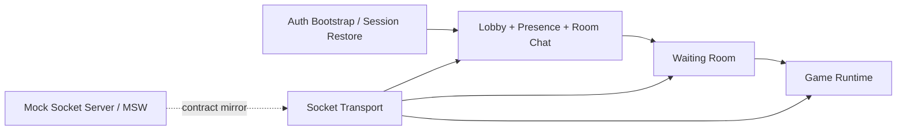

# AI Architecture Overview

이 문서는 AI가 저장소 구조를 빠르게 다시 잡을 수 있도록 만든 high-level map이다.
세부 규칙은 `AGENTS.md`, `docs/ai/manuals/*`, `docs/rules.md`, `docs/testing.md`를 source of truth로 따른다.

## Runtime Flow

## Boundary Notes

- auth/session은 앱 진입, 세션 복구, resume navigation의 시작점이다.
- lobby / presence / room-chat은 같은 realtime manual과 targeted validation을 공유한다.
- waiting-room은 lobby와 game start 사이의 상태 전이 경계다.
- game runtime은 `GamePage`, `components/game`, `components/board`, `hooks/game`, store, socket handler가 함께 움직이는 경계다.
- mock/real contract가 바뀌면 타입, mock handler, 테스트, 문서를 같이 갱신한다.
